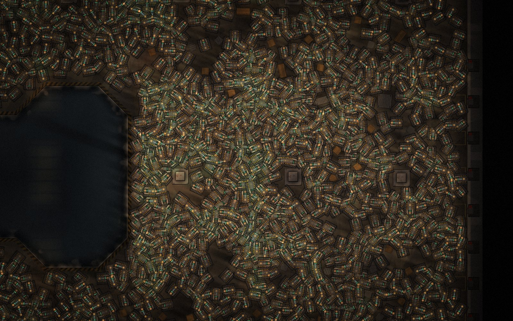
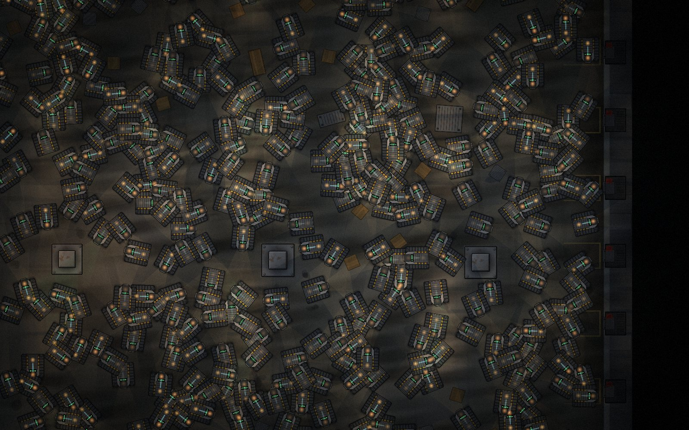

# Robot Automation Game

A top-down factory-automation game about robots, running in the browser. It is written in TypeScript on top of raw WebGL2 - no game engine.



**Status:** prototype, not continued. I built it over a couple of days in August 2026 to test an idea, and I don't plan to finish it. Everything below runs, though.

## The idea

Most incremental games grow by making a number bigger. The plan here was that every new kind of robot should bring a new *verb* instead: ground robots first, then flying, then water, then space. You select robots and give them orders directly (RTS-style), and automation is meant to be layered on top of that later.

The first level is a single grimy warehouse hall with a flooded dock cut into it. Trucks back up to the loading bays, and your robots haul crates from the floor into the trailers before the trucks leave.



## What is in it

- A WebGL2 renderer with a fixed pass order: albedo, light, composite, glow, and an unlit overlay. Every robot goes through one instanced sprite batch, so there is no draw call per robot. In my tests it holds about 26,000 robots at 30 fps in one hall.
- Robot state lives in typed arrays (a `Float32Array`/`Uint8Array` per field) and not in an object per robot. That is most of the reason the count can get that high.
- A full 24-hour day/night cycle from one "neutral" floor bake. The bake has no lighting in it at all, so the sun, the sodium work lamps, the daylight through the roof and the shadows are all done in the light pass.
- Pathfinding on an invisible nav grid with A* and string pulling, so robots move freely and never look like they are on a grid. Collisions use a spatial hash.
- Drag-select, move orders, queued waypoints (shift + right-click), crate pickup and drop-off with loader-arm animations, trucks that arrive, fill up and leave, batteries, charging points, and a small economy board on the wall.
- Procedural sound, synthesised in the browser.
- The whole level is generated from one seed and is deterministic.

The rules the renderer has to follow are in [`ai-instructions/CLAUDE.md`](ai-instructions/CLAUDE.md), and the full feature list with dates is in [`ai-instructions/FEATURES.md`](ai-instructions/FEATURES.md).

## Running it

```bash
npm install
npm run dev
```

Then open http://localhost:7443. Press **F1** for the debug console, where you can spawn robots (+1 / +10 / +100 / +1000), change the time of day and turn render passes on and off.

```bash
npm test          # vitest
npm run build     # type-check + production build
```
